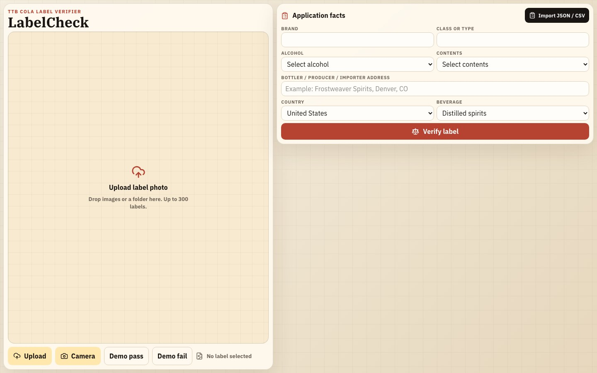
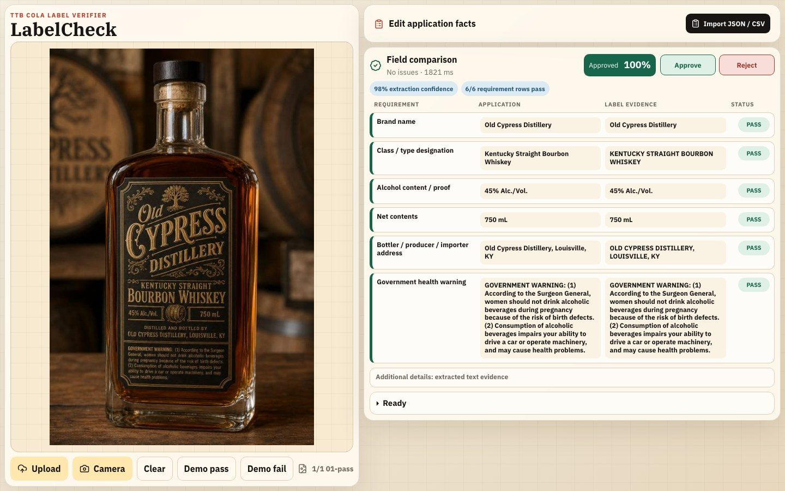

# LabelCheck Agent

AI-powered alcohol label verification for TTB-style compliance review.

**Live:** <https://cola.maxpetrusenko.com>

Vision reads the label; deterministic rules compare extracted text to the application record; the reviewer makes the final Approve or Reject decision with optional reason and notes. Standalone proof of concept — no COLAs integration.

## Reviewer UI

| Before verification | After verification |
| --- | --- |
|  |  |

**Demo pass** / **Demo fail** on the live app load fixture label + JSON without uploading files.

## Requirements

Take-home scope: [`docs/requirements.md`](docs/requirements.md). Full trace (evidence, gaps, peer notes): [`docs/REQUIREMENTS_TRACE.md`](docs/REQUIREMENTS_TRACE.md).

### Required Scope

| # | Required deliverable | Status |
| --- | --- | --- |
| 1 | Working deployed prototype | **Done** |
| 2 | Source repo + README setup, approach, tools, assumptions, limits | **Done** |
| 3 | Reviewer checks label artwork against application facts | **Done** |
| 4 | Required fields: brand, class/type, alcohol content, net contents, bottler/producer/importer, import origin, government warning | **Done** (spirits strongest) |
| 5 | Government warning exact text and all-caps `GOVERNMENT WARNING:` | **Done** (visual font/placement documented as limited) |
| 6 | Human judgment retained; no blind auto-approval/denial | **Done** |
| 7 | Formatting equivalence, not dumb exact-match-only behavior | **Done** |
| 8 | Results in about 5 seconds | **Done** ([`docs/SPEED_EVIDENCE.md`](docs/SPEED_EVIDENCE.md)) |
| 9 | Clean, obvious UI + clear error handling | **Done** |
| 10 | Standalone prototype; no COLAs integration | **Done** |
| 11 | Security/cloud API assumptions documented | **Done** |
| 12 | Sample distilled spirits labels | **Done** ([fixtures](#fixtures)) |

### Nice-To-Haves / Stakeholder Wants

| Nice-to-have | Status |
| --- | --- |
| Batch upload / review for 200–300 label spikes | **Done for V1**: browser and CLI image/folder batches, progressive 25-label API chunks, partial-safe rows |
| Imperfect / bad photo handling | **Done for V1 triage**: low-confidence, glare/skew/unreadable/multi-product cases route to review instead of false pass |
| Mismatch highlighting | **Done for V1**: image-side issue callouts plus expected/observed field table |
| Broader beer/wine/profile coverage | **Started**: common matching and limited exceptions; deeper commodity profiles remain future work |
| Reviewer productivity features | **Done for V1**: pass/fail/review signals, batch rail, Approve/Reject decisions, export |
| Robust judgment cases | **Done for V1**: case, punctuation, apostrophe, unit, and proof/ABV normalization |

**Out of V1 / not required by the take-home:** mock COLA queue, durable server-side batch jobs, server-side audit logs, FedRAMP, auth/RBAC, retention policy, exact font/bold/contrast/placement verification, and true pixel-level bounding boxes.

## Approach

1. **Blind extraction** — vision sees only the label, not application facts ([ADR 0001](docs/decisions/0001-blind-extraction.md)).
2. **Deterministic rules** — pass / fail / needs-review ([ADR 0002](docs/decisions/0002-deterministic-rules.md)).
3. **Human decision** — reviewer approves or rejects; no silent auto-denial ([ADR 0003](docs/decisions/0003-human-in-the-loop-no-auto-denial.md)).

**Assumptions:** one image = one label panel; cloud vision (Gemini default); no upload persistence or COLAs API; rules approximate TTB for demo speed, not legal sign-off.

**Trade-off:** speed and explainable checks over full commodity coverage and regulatory layout verification.

## Stack

Next.js (App Router), TypeScript, Tailwind, Zod, Vitest, Playwright desktop + mobile smoke coverage, Gemini/OpenAI vision, Braintrust tracing (optional), `labelcheck` CLI + OpenAPI.

## Fixtures

Team dataset: [fsyeddev/ttb-label `evals/fixtures/generated`](https://github.com/fsyeddev/ttb-label/tree/main/evals/fixtures/generated).

```text
public/evals/fixtures/spirits-generated-canonical/   # PNG + JSON + manifest
public/evals/fixtures/spirits-rendered-regression/   # deterministic SVG/HTML set
```

**Demo pass** uses `01-pass-01`. Regenerate: `npm run fixtures:generate` · evaluate: `npm run eval:fixtures`.

## Quick start

Node.js 18+, npm.

```bash
git clone https://github.com/maxpetrusenko/alcohol-label-verifier.git
cd alcohol-label-verifier
npm install
cp .env.example .env.local
# optional: GEMINI_API_KEY=...
npm run dev
```

Open <http://localhost:3000> · health: `curl -fsS http://localhost:3000/api/health | jq`

Optional: `doppler secrets download --no-file --format env -p api_keys -c dev >> .env.local` · README screenshots: `npm run screenshots:readme` · `git config core.hooksPath .githooks` (drops Cursor co-author trailers)

## Environment

| Variable | Purpose |
| --- | --- |
| `GEMINI_API_KEY` | Vision extraction (default) |
| `VISION_PROVIDER` | `gemini` or `openai` |
| `OPENAI_API_KEY` | OpenAI vision |
| `ALCOHOL_LABEL_VERIFIER_BRAINTRUST_*` | Optional tracing |

See [`.env.example`](.env.example).

## Test and build

```bash
npm run test && npm run test:e2e && npm run lint && npm run build
```

`npm run test:e2e` runs both desktop Chromium and mobile Chrome viewport checks; mobile layout regressions are release blockers.

## API and CLI

| Route | Description |
| --- | --- |
| `GET /api/health` | Service + provider status |
| `POST /api/verify` | Verify label(s) vs application facts |
| `POST /api/extract` | Extract fields only |

```bash
npx labelcheck health
npx labelcheck verify ./front.png --facts ./application.json
npx labelcheck verify ./label-photos --facts ./applications.csv
npm run demo:cli
```

[`docs/API.md`](docs/API.md) · versioned routes `/api/v1/*`

## Docs

| Doc | Purpose |
| --- | --- |
| [`docs/REQUIREMENTS_TRACE.md`](docs/REQUIREMENTS_TRACE.md) | Full matrix + fixture map |
| [`docs/PRESEARCH.html`](docs/PRESEARCH.html) | Product flow |
| [`docs/SPEED_EVIDENCE.md`](docs/SPEED_EVIDENCE.md) | Latency evidence |
| [`docs/decisions/`](docs/decisions/) | ADRs |
