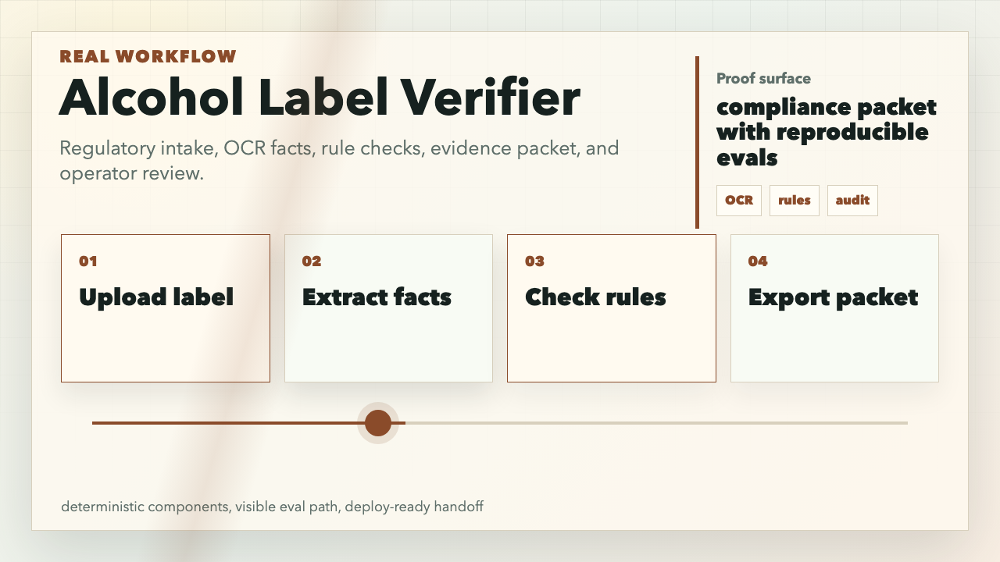
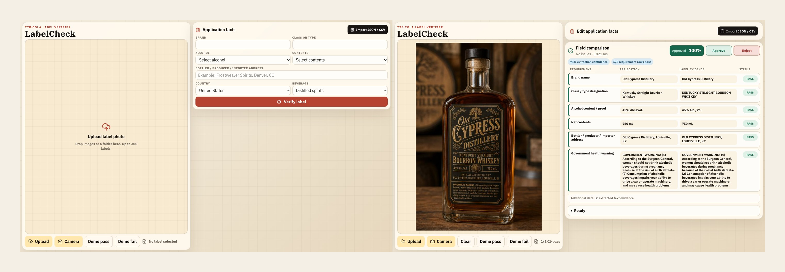
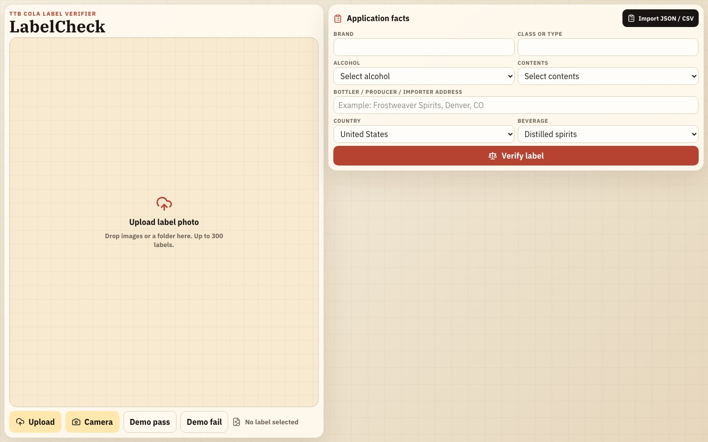
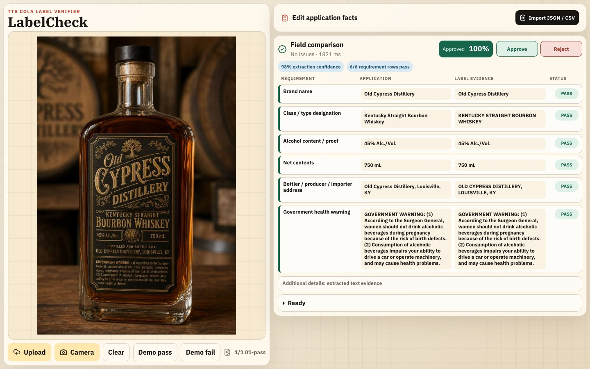

# LabelCheck Agent

Regulated AI workflow for alcohol label review: blind vision extraction, deterministic compliance rules, human disposition, and exportable review evidence.

**Live:** <https://cola.maxpetrusenko.com>

LabelCheck is a standalone prototype, not a COLAs integration or legal approval system. It is built to show the trust boundary: the model reads the label, TypeScript rules make repeatable findings, and the reviewer makes the final Approve or Reject decision with optional reason and notes.



[Watch the 8-second workflow video](docs/assets/alcohol-label-verifier-workflow.mp4)



## What It Proves

| Regulated workflow claim | Proof in this repo |
| --- | --- |
| Vision extraction is blind | [`/api/extract`](docs/API.md#post-apiv1extract) and [ADR 0001](docs/decisions/0001-blind-extraction.md): label evidence is extracted before expected application facts enter the flow. |
| Compliance findings are deterministic | [`src/lib/rules.ts`](src/lib/rules.ts) and [ADR 0002](docs/decisions/0002-deterministic-rules.md): rules compare normalized expected vs observed fields and return pass, fail, or needs-review. |
| Human review stays in control | UI disposition buttons, notes, reason codes, export packets, and [ADR 0003](docs/decisions/0003-human-in-the-loop-no-auto-denial.md). |
| Auditability is explicit | API responses include request IDs, per-field expected/observed evidence, rule IDs, status, elapsed time, and exportable JSON/CSV packets. No server-side audit persistence is claimed for V1. |
| Eval fixtures are reproducible | Canonical, rendered, degraded, and wine fixtures live under [`public/evals/fixtures`](public/evals/fixtures). Fixture evals run through Vitest. |
| CI covers core quality gates | [`.github/workflows/ci.yml`](.github/workflows/ci.yml) runs lint, unit tests, Playwright E2E, React Doctor, and production build. |
| Failure modes are documented | Low confidence, glare/skew/unreadable photos, multi-product images, provider timeout, missing facts, and unsupported beverage profiles route to review or bounded errors. |

## Reviewer Demo

Use **Demo pass** / **Demo fail** on the live app to load fixture label images and application JSON without uploads.

| Before verification | After verification |
| --- | --- |
|  |  |

## Requirements

Take-home scope: [`docs/requirements.md`](docs/requirements.md). Full trace (evidence, gaps, peer notes): [`docs/REQUIREMENTS_TRACE.md`](docs/REQUIREMENTS_TRACE.md).

### Required Scope

| # | Required deliverable | Status |
| --- | --- | --- |
| 1 | Working deployed prototype | **Done** |
| 2 | Source repo + README setup, approach, tools, assumptions, limits | **Done** |
| 3 | Reviewer checks label artwork against application facts | **Done** |
| 4 | Required fields: brand, class/type, alcohol content, net contents, bottler/producer/importer, import origin, government warning | **Done** (spirits strongest) |
| 5 | Government warning exact text and all-caps `GOVERNMENT WARNING:` | **Done** (visual font/placement documented as limited) |
| 6 | Human judgment retained; no blind auto-approval/denial | **Done** |
| 7 | Formatting equivalence, not dumb exact-match-only behavior | **Done** |
| 8 | Results in about 5 seconds | **Done** ([`docs/SPEED_EVIDENCE.md`](docs/SPEED_EVIDENCE.md)) |
| 9 | Clean, obvious UI + clear error handling | **Done** |
| 10 | Standalone prototype; no COLAs integration | **Done** |
| 11 | Security/cloud API assumptions documented | **Done** |
| 12 | Sample distilled spirits labels | **Done** ([fixtures](#fixtures)) |

### Nice-To-Haves / Stakeholder Wants

| Nice-to-have | Status |
| --- | --- |
| Batch upload / review for 200–300 label spikes | **Done for V1**: browser and CLI image/folder batches, progressive 25-label API chunks, partial-safe rows |
| Imperfect / bad photo handling | **Done for V1 triage**: low-confidence, glare/skew/unreadable/multi-product cases route to review instead of false pass |
| Mismatch highlighting | **Done for V1**: image-side issue callouts plus expected/observed field table |
| Broader beer/wine/profile coverage | **Started**: common matching and limited exceptions; deeper commodity profiles remain future work |
| Reviewer productivity features | **Done for V1**: pass/fail/review signals, batch rail, Approve/Reject decisions, export |
| Robust judgment cases | **Done for V1**: case, punctuation, apostrophe, unit, and proof/ABV normalization |

**Out of V1 / not required by the take-home:** mock COLA queue, durable server-side batch jobs, server-side audit logs, FedRAMP, auth/RBAC, retention policy, exact font/bold/contrast/placement verification, and true pixel-level bounding boxes.

## Approach

1. **Blind extraction**: vision sees only label evidence, not the application facts ([ADR 0001](docs/decisions/0001-blind-extraction.md)).
2. **Deterministic rules**: findings are generated by testable TypeScript rules, not by model policy judgment ([ADR 0002](docs/decisions/0002-deterministic-rules.md)).
3. **Human decision**: reviewer accepts, rejects, overrides, or escalates; no silent auto-denial ([ADR 0003](docs/decisions/0003-human-in-the-loop-no-auto-denial.md)).
4. **Audit packet**: the review result can be exported without retaining raw image data by default.

**Assumptions:** one image = one label panel; cloud vision (Gemini default); no upload persistence or COLAs API; rules approximate TTB for demo speed, not legal sign-off.

**Trade-off:** speed and explainable checks over full commodity coverage and regulatory layout verification.

## Stack

Next.js (App Router), TypeScript, Tailwind, Zod, Vitest, Playwright desktop + mobile smoke coverage, Gemini/OpenAI vision, Braintrust tracing (optional), `labelcheck` CLI + OpenAPI.

## Workflow Surface

| Step | Input | Output | Trust boundary |
| --- | --- | --- | --- |
| Extract | Label image or OCR text | Observed brand, class/type, ABV/proof, contents, origin, bottler/importer statement, warning text, confidence | Model is a reader only. Expected application facts are withheld. |
| Compare | Extracted evidence + application record | Rule rows with expected value, observed value, status, severity, rationale, and requirement references | Rules are deterministic and covered by fixtures/tests. |
| Review | Findings, image, reviewer notes | Approve, reject, or escalate disposition with optional reason | Human owns final action. |
| Export | Verification result + adjudication | JSON or CSV packet with request ID, raw image policy, rows, and reviewer disposition | V1 is client-held export, not durable server audit storage. |

## Failure Modes

| Condition | V1 behavior |
| --- | --- |
| Missing provider key or provider outage | Falls back to text-only evidence when supplied, or returns bounded extraction failure. |
| Low confidence, glare, skew, unreadable text | Routes to needs-review instead of inventing a pass. |
| Multi-product or ambiguous shelf photo | Blocks or escalates until the reviewer supplies an isolated label target. |
| Missing application fact | Marks the field as missing-source-data instead of pretending to verify it. |
| Unsupported beverage profile | Returns a blocking profile check; distilled spirits are the strongest V1 path. |
| Layout-only requirements | Documented limitation: font size, contrast, placement, separation, and same-field-of-vision need layout-aware evidence not shipped in V1. |

## Fixtures

Team dataset: [fsyeddev/ttb-label `evals/fixtures/generated`](https://github.com/fsyeddev/ttb-label/tree/main/evals/fixtures/generated).

```text
public/evals/fixtures/spirits-generated-canonical/   # PNG + JSON + manifest
public/evals/fixtures/spirits-rendered-regression/   # deterministic SVG/HTML set
public/evals/fixtures/stress-degraded-samples/       # committed degraded-photo triage cases
public/evals/fixtures/wine-rendered-canonical/       # wine common-field coverage
```

**Demo pass** uses `01-pass-01`. Regenerate: `npm run fixtures:generate`. Evaluate: `npm run eval:fixtures`, `npm run eval:html-fixtures`, `npm run eval:degraded-fixtures`.

## Quick start

Node.js 18+, npm.

```bash
git clone https://github.com/maxpetrusenko/alcohol-label-verifier.git
cd alcohol-label-verifier
npm install
cp .env.example .env.local
# optional: GEMINI_API_KEY=...
npm run dev
```

Open <http://localhost:3000> · health: `curl -fsS http://localhost:3000/api/health | jq`

Optional: `doppler secrets download --no-file --format env -p api_keys -c dev >> .env.local` · README screenshots: `npm run screenshots:readme` · `git config core.hooksPath .githooks` (drops Cursor co-author trailers)

## Environment

| Variable | Purpose |
| --- | --- |
| `GEMINI_API_KEY` | Vision extraction (default) |
| `VISION_PROVIDER` | `gemini` or `openai` |
| `OPENAI_API_KEY` | OpenAI vision |
| `ALCOHOL_LABEL_VERIFIER_BRAINTRUST_*` | Optional tracing |

See [`.env.example`](.env.example).

## Test and build

```bash
npm run test && npm run test:e2e && npm run lint && npm run build
```

`npm run test:e2e` runs both desktop Chromium and mobile Chrome viewport checks; mobile layout regressions are release blockers.

CI runs the same product gates plus React Doctor. For a local proof packet, run:

```bash
npm run demo:cli
npm run eval:fixtures
npm run screenshots:readme
```

## API and CLI

| Route | Description |
| --- | --- |
| `GET /api/health` | Service + provider status |
| `POST /api/verify` | Verify label(s) vs application facts |
| `POST /api/extract` | Extract fields only |

```bash
npx labelcheck health
npx labelcheck verify ./front.png --facts ./application.json
npx labelcheck verify ./label-photos --facts ./applications.csv
npx labelcheck export ./verify-response.json --format csv
npm run demo:cli
```

[`docs/API.md`](docs/API.md) · [`docs/openapi.json`](docs/openapi.json) · versioned routes `/api/v1/*`

## Docs

| Doc | Purpose |
| --- | --- |
| [`docs/REQUIREMENTS_TRACE.md`](docs/REQUIREMENTS_TRACE.md) | Full matrix + fixture map |
| [`docs/API.md`](docs/API.md) | API, CLI, batch, export, and limitation contract |
| [`docs/PRESEARCH.html`](docs/PRESEARCH.html) | Product flow and competitor notes |
| [`docs/SPEED_EVIDENCE.md`](docs/SPEED_EVIDENCE.md) | Latency evidence |
| [`docs/decisions/`](docs/decisions/) | ADRs |
